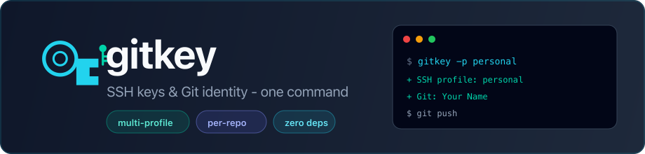
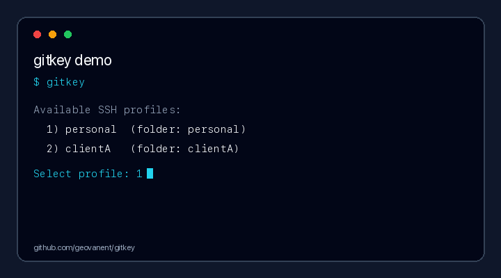

<p align="center">
  
</p>

<p align="center">
  <a href="LICENSE"></a>
  
  
</p>

<p align="center">
  
</p>

<p align="center">
  <strong>One CLI for every Git identity you juggle.</strong><br>
  Switch SSH keys, set <code>user.name</code> / <code>user.email</code>, enable signed commits,<br>
  or bind a key to a single repo — without editing configs by hand.
</p>

<details>
<summary>Project layout</summary>

```text
gitkey/
├── gitkey          CLI entrypoint
├── install.sh      installer
├── lib/            application code
├── docs/           guides
├── assets/         readme images
└── scripts/        maintainer tools
```

Your config: `~/.ssh/gitkey/settings.py`

</details>

---

## Why gitkey?

| Problem | gitkey |
|---------|--------|
| `git push` with the wrong GitHub account | Switch profile in one command |
| Two clients open at the same time | `--bind` per repository |
| Unsigned commits on client work | Toggle **signed commits** per profile |
| New client = manual `ssh-keygen` + edit files | `gitkey --new` wizard |

**Signed commits (SSH)** — enable per client in the config menu. gitkey sets up `allowed_signers`, `commit.gpgsign`, and the signing key. Add the public key on GitHub as a **Signing Key** → commits show as Verified.

---

## Install

### macOS / Linux

```sh
curl -fsSL https://raw.githubusercontent.com/geovanent/gitkey/main/install.sh | bash
```

### Windows (PowerShell)

```powershell
irm https://raw.githubusercontent.com/geovanent/gitkey/main/install.ps1 -OutFile $env:TEMP\gitkey-install.ps1; powershell -ExecutionPolicy Bypass -File $env:TEMP\gitkey-install.ps1
```

After install, **open a new terminal** and run `gitkey`.

<details>
<summary>Already cloned the repo?</summary>

**macOS / Linux**
```sh
cd ~/.ssh/gitkey && ./install
```

**Windows**
```powershell
cd $env:USERPROFILE\.ssh\gitkey
.\install.cmd
```

</details>

See also: [Windows Installation](docs/install-windows.md)

---

## Quick start

```sh
gitkey --new          # new client + SSH key + profile (wizard)
gitkey                # menu: pick profile, configure, or create
gitkey -p personal    # switch global key + Git identity
gitkey --bind -p clientA   # this repo only — keep other keys active
```

**Settings UI** (toggle signed commits, edit email, regenerate keys):

```sh
gitkey --config
```

---

## Commands

| Command | What it does |
|---------|----------------|
| `gitkey` | Interactive menu — switch, **new client**, **settings** |
| `gitkey --new` | Wizard: profile + `ssh-keygen` + save to `settings.py` |
| `gitkey --config` | Per-client settings: signing on/off, name, email, keys |
| `gitkey -p <name>` | Activate profile globally |
| `gitkey --bind -p <name>` | Bind profile to current repo |
| `gitkey --binds` | List repo bindings |
| `gitkey -p auto` | Rotate to next profile |

```sh
gitkey -p clientA --no-git    # SSH key only
gitkey --bind -p clientA -r ~/work/client   # bind all repos under a folder
gitkey --unbind
gitkey --reset / gitkey -f    # fix last commit author
```

---

## Two modes

| | Global | Per repository |
|---|--------|----------------|
| **Command** | `gitkey -p personal` | `gitkey --bind -p clientA` |
| **SSH key** | Replaces `~/.ssh/id_ed25519` | Local `core.sshCommand` only |
| **Best for** | One identity at a time | Several repos, different keys |

---

## Docs

| Guide | Topic |
|-------|--------|
| [Configuration](docs/configuration.md) | `settings.py`, folders |
| [Commit signing](docs/commit-signing.md) | GitHub Verified badge |
| [Troubleshooting](docs/troubleshooting.md) | Common fixes |

---

<p align="center">
  <sub>MIT · <a href="https://github.com/geovanent/gitkey">github.com/geovanent/gitkey</a></sub>
</p>
